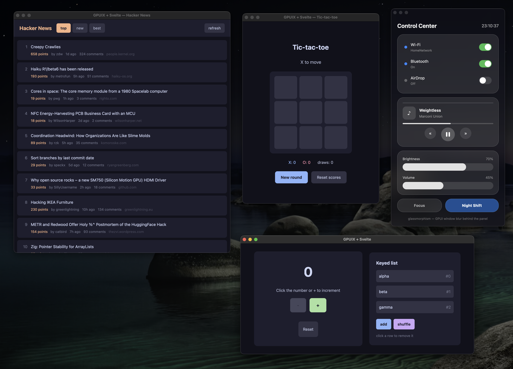

# gpuix-svelte

> **Work in progress.** Experimental — built on Svelte's unreleased
> [custom renderer API](https://github.com/sveltejs/svelte/pull/18511). Tested on macOS / Windows, also compatible with Linux.

> [!IMPORTANT]
> Needs **Node.js >= 26.1** — the liquid-glass FFI demo drives its ObjC shim through the built-in
> `node:ffi`, which landed in 26.1 — or **Bun >= 1.4.0**, which uses `bun:ffi` instead.

Svelte custom renderer for [GPUI](https://www.gpui.rs/) (Zed's GPU-accelerated UI framework), via
[`@gpuix/native`](https://www.npmjs.com/package/@gpuix/native). Native desktop windows from ordinary
Svelte components — no webview.

## What does it look like?

The four demos — Hacker News, tic-tac-toe, the liquid-glass control center and the counter — each in
its own native window.



## Try it

No Rust or other toolchains needed — the native binary comes prebuilt from npm.

```bash
git clone https://github.com/khromov/gpuix-svelte
cd gpuix-svelte
npm install
npm run demo              # all four demos at once
npm run demo:counter      # counter — edit examples/counter/Counter.svelte and save to hot-reload
npm run demo:tictactoe    # tic-tac-toe with score tracking
npm run demo:hn           # Hacker News reader (live data, scrollable list)
npm run demo:glass        # liquid-glass control center (GPUI's blurred translucent window)
npm run demo:glass-ffi    # same app on REAL Liquid Glass — NSGlassEffectView via FFI
                          # (macOS 26+; falls back to the window blur elsewhere)
npm run demo:styling      # styling playground — which CSS text reaches GPUI and which is dropped
npm test                  # headless renderer tests
```

Every command has a [Bun](https://bun.com) twin under a `bun:` prefix — `npm run bun:test`,
`npm run bun:demo`, `npm run bun:demo:counter`, and so on. They run the same entry points through
Bun, which picks the `.svelte` loader up from `bunfig.toml` instead of `--import`. Dependencies
still come from `npm install` either way; there is one lockfile, and CI runs both runtimes.

## Use in your own project

```bash
npm install github:khromov/gpuix-svelte     # until it's on npm
npm install -D svelte@https://pkg.svelte.dev/svelte/pr/18511    # latest build of the custom-renderer PR
```

`svelte` has to be Svelte's unreleased custom-renderer branch; pkg.svelte.dev serves its latest
build (this repo pins one specific commit under `vendor/` instead, see `CLAUDE.md`).

The `.svelte` loader has to be registered before your entry module resolves. On Node that is
`--import gpuix-svelte/register`; on Bun it is a `bunfig.toml` preload:

```toml
preload = ["gpuix-svelte/plugin"]
```

```js
// app.js
import { render_hot } from "gpuix-svelte";

render_hot(new URL("./App.svelte", import.meta.url), {
  title: "Hello GPUI",
  width: 820,
  height: 560,
});
```

Run with both conditions flags — they are **required** (without them Svelte resolves to its server
build and `mount()` doesn't exist):

```bash
node --conditions custom-renderer --conditions development --import gpuix-svelte/register app.js
```

See [HOWTO.txt](HOWTO.txt) for a few more details and troubleshooting notes.

## License

MIT
